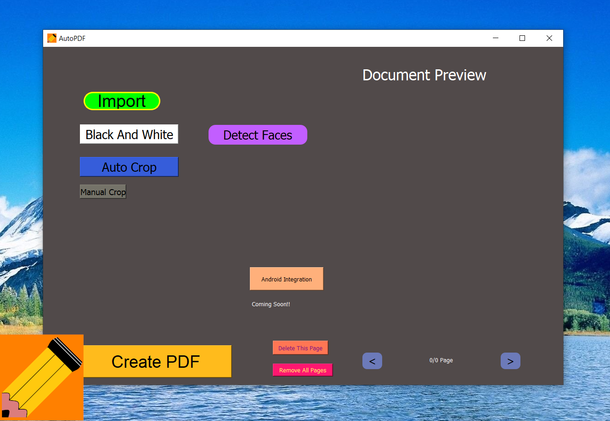

# AutoPDF


AutoPDF is a program to help convert pictures into pdf.
made by @Satash-V-Raws @Atharvsam
## Presentations in 'ppt' folder
## Video Link is attached to submission(DevFolio)
During these Corona Times, we have to submit all our assignments, homeworks and sometimes tests online by converting them into pdf. Mostly such services are found online, we have even tried multiple other apps used for similar purposes but found none to be satisfactory. Hence, we decided to make our own.



## Requirements
- Python>=3.61
- PyQt5 
```python -m pip install PyQt5```
- Opencv 
```python -m pip install opencv-contrib-python```
- imutils 
```python -m pip install imutils```
- PIL
```python -m pip install PIL```

## FEATURES (Some Will Get Implemented Soon) Android Integration Possible Soon!!!
- Black and white filter
- Auto Crop
- Auto Rotation
- Annotation
- Word Finding
- Text Add
- Face Detection
- Takes less memory than other apps built for similar purposes

## Language Used
-Python
